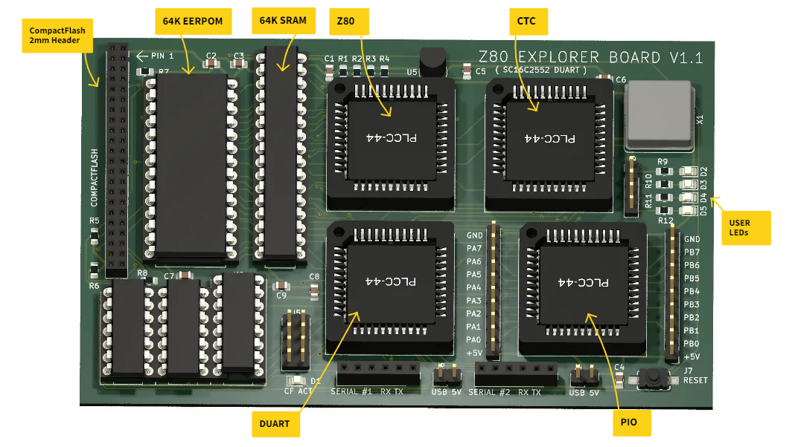

# Zilog Z80 Curiosity Board #1

I've recently had time to go back to my youth and re-discover some of the microprocessors that were available at the time. This is my first Z80 board. I wanted to put together a small board that had a Z80 as well as PIO (parallel I/O), SIO (serial I/O) and CTC (Counter Timer) chips.

I chose to use PLCC devices to try and keep the board size small enough to keep the costs down at JLCPCB. That decision proved to be a problem as I thought I'd sourced some SIO/2 chips in PLCC44 packaging. Unfortunately my source let me down and I decided to go with an SC16C2554 DUART instead.

## Description

The aim of this project is to see if I can build my own Z80 based system to experiment on. As well as the Z80 processor (Z84C0020VEC), it will have some parallel I/O (Z84C2010VEG), serial I/O (SC16C2554) and some counter timers (Z84C3010VEC) . I also wanted to see if I could port CP/M to this hardware as an additional challenge, so the design would need a CompactFlash card interface. My starting point for CP/M was Grant Searles excellent [web page](http://searle.x10host.com/cpm/index.html).

## Design

The design is fairly straightforward, using a skinny 64Kb SRAM from my stash as well as a 64Kb EEPROM for non volatile storage.

I studied other designs that I came across and liked a concept that I came across whereby on startup, the whole of the ROM was copied into RAM and then the ROM disabled. The hardware was configured so that the ROM and the RAM both occupied the same 64Kb, but initially any read accessed would go to the ROM and any write accesses would go to the RAM. Once the ROM was copied into RAM (at the same addresses), the ROM would be disabled giving full read/write access to the RAM and the Z80 would continue to execute instructions as if nothing had happened.

The design uses simple logic chips to handle the address decoding, as well as the disabling of the ROM etc.

# The board layout

This is an annotated 3D view of the board generated by Kicad as it stands at v1.1.

# Software

I adapted Dave Dunfields MONZ80 monitor program to work with this board. MONZ80 can be found on [Dave's website](https://dunfield.themindfactory.com/dnldsrc.htm) as part of the MONITORS.ZIP file. There is no documentation for the monitor but most of the commands are self explanatory.

The monitor code needs tweeking to support the specific UART hardware I am using but that simply involves providing code to initialise the UART and code to output a characher/byte as well as read in a character/byte. My modified version of MONZ80 is in the code folder and has been edited to allow assembly using the free online assembler at [ASM80.COM](https://asm80.com) - select the Z80 CPU.

# Known errors

* The initial design messed up the addressing of the DUART chip such that only one serial port was available. Cutting a few tracks and adding a few jumper wires sorted that error out. The changes are detailed on the Kicad schematic.

* The choice of the SC16C2554 DUART meant that I couldn't use IM2 for interrupts. The initial code for the interrupt handlers had to be at the start of memory - just where CP/M also needed to store information. 

# Conclusions

The board works, but sadly not how I had hoped due to the interrupt issue mentioned above.

It is possible to run CP/M on this board once the files are loaded onto the CompactFlash card. That is where the issue lies. It is possible to follow Grant Searles instructions on transferring files onto the CF card using the DOWNLOAD command and the packaging tool, but in order to do so, there needs to be pauses between lines and between characters when sending the files over as there is no way for the CP/M system to use an interrupt driven serial handler to buffer the data.

## License

This project is licensed under the GNU General Public License v3.0 - see the LICENSE.md file for details
